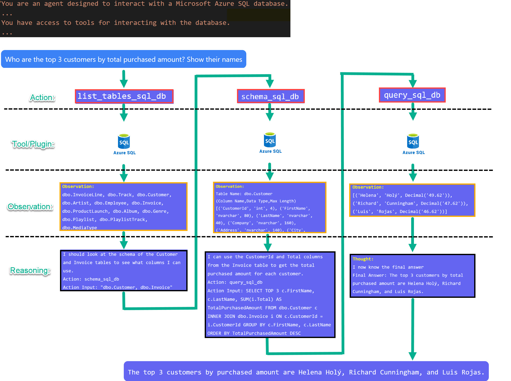

<h1 align="center">
  ChatGPT with SQL Server by Azure OpenAI  💡
</h1>

  <strong>Database Assistant with Azure OpenAI</strong>

  <strong>SqlGPT with Azure OpenAI</strong> is a sample Question and Answering bot using Azure OpenAI. It's designed to demonstrate how to use your own data in SQL Server for QnA.

  This demo shows how GPT demo can perform logic by demonstrating 
  - plan for action
  - update its plan with new collected information until goal is achieved
  
  

## Project structure
- Application - flask app (main application) with a simple HTML as frontend

## QuickStart

Note: Make sure you have docker installed

1. Open dowload this repository with `git clone https://github.com/louis-li/SqlGPT.git`
2. in application folder, mv .env.sample .env
3. Edit .env file and add your Azure OpenAI key and end point
4. Edit SQL Server/database/username/password info in .env file
5. Run `docker-compose build && docker-compose up`
6. Navigate to http://localhost:5010/

To stop just run Ctrl + C

Built with [🦜️🔗 LangChain](https://github.com/hwchase17/langchain)

